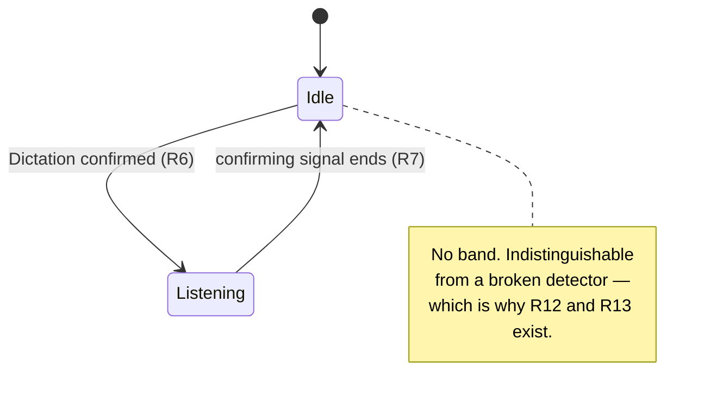
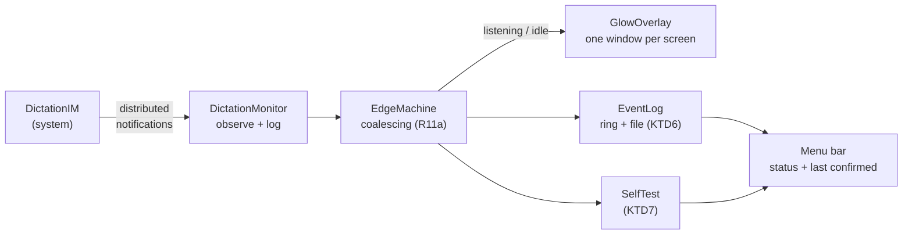
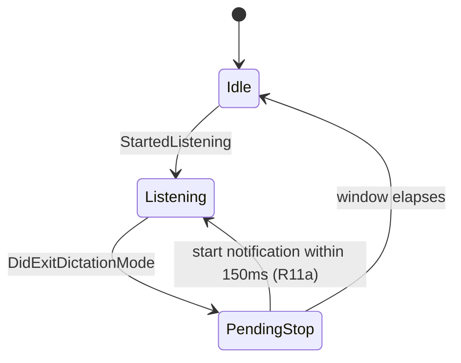

# Dictation Glow - Plan

## Goal Capsule

- **Objective:** A person dictating on this Mac knows at a glance, without looking away from what they are doing, whether native Dictation is currently listening — and notices the moment it stops on its own.
- **Means:** The overlay is fixed: axshot's perimeter band, in Dictation blue, one frame per display. The detection mechanism is now fixed too — the distributed-notification pair `DictationIMNotificationStartedListening` and `DictationIMNotificationDidExitDictationMode`, verified across live sessions on 2026-09-20.
- **Product authority:** The decisions below, settled in the brainstorm dialogue. `HANDOFF.md` is the originating brief.
- **Execution profile:** Swift, SwiftPM, no Xcode project. Built and signed by `build.sh` into `/Applications`. Verified by `swift test` for pure logic and by live gates against real Dictation for everything else.
- **Who finishes it:** the implementing agent carries U1 through U8 and opens a pull request; merging stays with the user.
- **Stop conditions:** stop if SwiftPM cannot produce a bundle-compatible binary (KTD1 is withdrawn and U1 falls back to `swiftc`), or if the notification names do not fire on the implementing machine — that invalidates R6 and the plan rather than the unit.
- **Open blockers:** None. The confirming signal was identified by direct observation rather than by the planned harness, so R19–R21 are now verification of the shipped detector rather than a phase that precedes it.

---

## Product Contract

### Summary

A menu bar utility that draws a blue band around the perimeter of every display for exactly as long as native macOS Dictation is listening, and removes it the moment Dictation stops — including the silence timeout that currently passes unnoticed. The border is drawn only when Dictation is positively confirmed, so the app carries a self-test that makes its own silence falsifiable.

### Problem Frame

Native Dictation stops on its own after roughly thirty seconds without continuous speech, and nothing announces the cut. The timeout is widely documented and macOS exposes no setting to disable or extend it, so it is a fixed constraint to design around rather than a defect to work around. The person keeps speaking into a microphone that is no longer listening. They discover it when they next look at the screen, by which point a sentence or a paragraph is gone and has to be said again.

The cost is not the lost words so much as the loss of trust in the channel. Dictation stops being something you can use while looking elsewhere, which is most of what it is for. The existing indicator — a small floating element near the insertion point — is exactly where the eyes are not.

The failure is specifically the stop edge. The start is announced by the person's own deliberate act of triggering it; the stop happens by itself, silently, and at an unpredictable moment.

### Key Decisions

- **The border is binary: full strength while listening, plain fade at the edges.** (session-settled: user-directed — chosen over a decay cue that tracks the silence timer, and over a loud exit flash: the border's disappearance is itself the signal, and a decay cue would require a live speech-activity signal that this design removes from scope.) Governs R4, R5.
- **Attribution fails closed.** (session-settled: user-directed — chosen over fail-open and over treating any live microphone as the trigger: no stray border during calls, accepted with the silent-failure cost that R12 and R13 exist to answer.) Governs R6, R10, R12, R13.
- **The app is a menu bar application.** (session-settled: user-directed — chosen over a headless launch agent and over a status item that appears only when unhealthy: the self-test and permission state need somewhere to live, and macOS needs a visible app to hang the TCC grants on.) Governs R12, R13.
- **The overlay and the permission provisioning are adopted from axshot rather than rebuilt.** (session-settled: user-directed — the window contract and TCC-stable signing are solved there and the failure modes are already documented.) Governs R1, R2, R15.
- **The band's blue is a fixed `#0A84FF`, chosen from rendered candidates rather than sampled from Apple's indicator.** (session-settled: user-directed — chosen over sampling the live Dictation indicator and over three other candidate blues, judged as the actual band on a dark desktop.) The value is fixed rather than appearance-following because the band is drawn over other applications' windows and states its own colour, as axshot's does. Governs R3.
- **The self-test is a guided live test, not a passive precondition check.** (session-settled: user-directed — chosen over a passive precondition check and over running both: a precondition check can report healthy while detection is broken, which is the exact failure the test exists to catch.) Governs R12.
- **A live microphone the app cannot attribute to Dictation gets no indication of its own.** (session-settled: user-directed — chosen over a quiet marker for the unattributed state and over a heuristic marker limited to dictation-shaped sessions: the guided live test answers the health question on demand, and a permanent marker would be present mostly during calls, which is not what it is for.) Governs R6.
- **The band never appears before Dictation is confirmed; there is no optimistic path.** (session-settled: user-directed — chosen over raising the band on a recognized Dictation shortcut and withdrawing it if confirmation did not follow, and over leaving the choice to the harness: a shortcut that does not actually start Dictation would produce a blue flash, which is the false positive fail-closed exists to prevent.) This also removes keyboard monitoring from scope, and with it an Accessibility dependency the app may otherwise not need. Governs R6.
- **The app launches at login by default.** (session-settled: user-directed — chosen over shipping the login item opt-in and over manual start only: an app that is not running produces no band, which is indistinguishable from idle Dictation and from a broken detector, and unlike those two the guided live test cannot diagnose it.) Governs R18.
- **When reliability and latency conflict, reliability wins.** (session-settled: user-directed — chosen over treating the 300ms stop budget as a hard gate that disqualifies slower signals, and over deferring the tradeoff to the harness report: a band that is always correct but slightly late still beats today, where one that is fast but sometimes wrong reintroduces the doubt this exists to remove.) Governs R6, R11.
- **The detector is built directly, without a preceding harness phase.** (session-settled: user-approved — supersedes "the diagnostic harness runs before the production detector is designed", which was written while the confirming signal was unknown.) Observing two real sessions answered the question the harness existed to answer, so the remaining unknowns — the start paths in R9 and the concurrent-microphone case — are verified against the real app instead. Governs R19, R20, R21.

### Requirements

**Overlay**

- R1. The overlay draws a band on the outer edge of every active display, one frame per display rather than one frame around the bounding box of all displays.
- R2. The overlay window does not activate, ignores mouse events, joins all Spaces, stays stationary, floats above full screen windows, and opts out of screen capture as far as the platform still allows. `sharingType = .none` excludes it from the legacy capture path only; since macOS 15.4 it no longer excludes a window from ScreenCaptureKit, so the band is expected to appear in modern screen recordings and shares.
- R3. The band is `#0A84FF`, the dark-variant macOS system blue. The value is fixed and does not follow the system appearance or accent colour.
- R4. The band is at full strength whenever it is shown and carries no partial or intermediate states.
- R5. The band fades in when Dictation starts listening and fades out when it stops.

**Detection**

- R6. The overlay is shown only while native macOS Dictation is positively confirmed to be listening; a live microphone that cannot be attributed to Dictation never raises it. Confirmation is the `DictationIMNotificationStartedListening` distributed notification, which is Dictation-specific by name and therefore needs no microphone attribution at all.
- R7. The stop is detected whatever its cause — the user ending Dictation, the silence timeout, or the dictating application losing focus.
- R8. Stop detection does not depend on the microphone stream closing. `DictationIMNotificationDidExitDictationMode` carries the stop edge independently, and leads the audio: measured 93ms and 78ms ahead of the capture closing across two sessions.
- R9. Detection is independent of how Dictation was started, covering the Globe double-tap, the Fn key, a custom shortcut, and the Edit menu.
- R10. Voice Control, Siri, and third-party dictation tools do not raise the overlay.
- R11. Where two candidate signals differ, the one with fewer false results is chosen over the faster one; the stop budget in Success Criteria is a target, not a disqualifier.
- R11a. A `DictationIMNotificationDidExitDictationMode` followed within 150ms by `WillStartListening` or `StartedListening` is part of a start sequence, not a stop, and does not lower the band. Both observed sessions emitted one.

**Health and self-report**

- R12. An on-demand self-test prompts the person to start Dictation and then reports whether both the start and the stop were observed and how quickly, naming the missing permission or signal when detection fails. It does not report health from preconditions alone.
- R13. The app records when it last successfully confirmed a Dictation session and shows that time.

**Build and provisioning**

- R15. Builds are signed with a stable self-signed certificate so TCC grants survive a rebuild; a build that falls back to ad-hoc signing says so rather than producing a binary whose grants will silently lapse.
- R17. The app is installed to `/Applications` and is never run from a temporary directory.

**Availability**

- R18. The app registers itself as a login item on first run so that a restart re-arms it without intervention, and the registration can be turned off.

**Detection verification**

- R19. The app logs every observed notification with a timestamp, so a session that failed to raise the band can be diagnosed after the fact rather than reproduced.
- R20. Detection is verified against a session where another application holds the microphone concurrently, and against each start path named in R9. These are the two cases the single observed signal has not yet been exercised on.
- R21. The detector's dependence on an undocumented notification name is recorded where a future reader will find it, together with the macOS version it was verified on and what the self-test will look like when the name changes.

### Key Flows

- F1. A dictation session
  - **Trigger:** The person starts Dictation by any of the paths in R9.
  - **Steps:** The confirming signal arrives and the band fades in. It stays at full strength for the session. The confirming signal going away — by any cause in R7 — fades it out.
  - **Outcome:** The band is up exactly while Dictation is confirmed listening, and never before.
  - **Covered by:** R4, R5, R6, R7

### Acceptance Examples

- AE1. Silence timeout
  - **Covers R5, R7.** Given Dictation is listening and the band is up, When the person stops speaking and Dictation times out, Then the band fades out within the stop budget.
- AE2. Concurrent microphone use
  - **Covers R8.** Given a video call holds the microphone and Dictation is also listening, When Dictation times out while the call continues, Then the band fades out — the still-open microphone stream does not hold it up.
- AE3. Microphone without Dictation
  - **Covers R6, R10.** Given Dictation is not running, When a call, a recording, or a third-party dictation tool opens the microphone, Then no band appears.
- AE4. A detector that has stopped working
  - **Covers R12.** Given the confirming signal no longer resolves, When the person runs the self-test and starts Dictation as it prompts, Then the test reports that the start was never observed and names the missing permission or signal, rather than reporting success because its preconditions still hold.
- AE5. Rebuild during development
  - **Covers R15.** Given the app is registered as a login item, When it is rebuilt and relaunched, Then the registration still holds and does not have to be re-approved.
- AE6. Displays of different heights
  - **Covers R1.** Given two displays of different heights, When the band is shown, Then each display carries its own complete band and no band segment runs through the dead space beside the shorter one.

### Success Criteria

- The stop is visible within roughly 300ms of Dictation ceasing to listen — about half a spoken word, so the person stops mid-word rather than mid-sentence. This is a target; per R11 a more reliable but slower signal is preferred to a faster one that is sometimes wrong.
- Over a week of ordinary use, the band never appears while Dictation is not running.
- No rebuild during development requires re-approving the login item.
- The self-test distinguishes a healthy detector with Dictation idle from a detector that has stopped working.

### Scope Boundaries

- Any cue that tracks the silence timer as it runs down — considered and cut with the binary decision above.
- Any indication for a live microphone the app cannot attribute to Dictation — considered and cut; the guided live test is the health mechanism.
- Raising the band optimistically on a keypress ahead of confirmation, and the keyboard monitoring it would require.
- Voice Control, Siri, and third-party dictation tools.
- Anything that changes Dictation's own behavior: no transcription, no text insertion, no keeping the session alive past its timeout.
- Audio and haptic feedback.
- Per-application suppression or configuration.
- iOS and iPadOS.

### Dependencies and Assumptions

- macOS 26.6.2 is the development target. The confirming notification is undocumented, so it may be renamed or withdrawn in any later release; R21 records that exposure and R12's self-test is what surfaces it.
- axshot is available as a sibling checkout to copy the band and the signing scripts from. It is a source, not a runtime dependency.
- The `Axshot Local Signing` identity is shared between the two applications. One keychain approval covers both, and TCC records stay independent because they key on bundle identifier.
- An application under a temporary directory cannot be granted Accessibility — LaunchServices registers no bundle there and `tccutil` cannot resolve the identifier — which is what R17 exists for. Requesting the grant from such a location also marks the client as prompted, so later requests return false with no dialog until the record is reset.
- The 300ms stop budget is derived from the purpose rather than measured, and is deliberately not a gate (R11).
- `sharingType = .none` is not capture protection on macOS 15.4 or later. Apple DTS states there are no public APIs for preventing screen capture, and a window marked `.none` is still captured by ScreenCaptureKit. Verified here only for the legacy path: a `screencapture` taken while the band was up did not contain it. The ScreenCaptureKit behaviour is taken from Apple's statement rather than measured, because measuring it needs a Screen Recording grant this app otherwise never asks for.
- The app requires no TCC grant of any kind, for detection or anything else. The notifications are delivered by `distnoted` to any process that observes them by name, the confirming signal reads no window, and neither the overlay nor `SMAppService` needs a grant. This is what retired R14 and R16.
- Microphone attribution turned out not to be needed, and the earlier note here was wrong on the facts. A public API does attribute a live microphone to a process: `kAudioHardwarePropertyProcessObjectList` with `kAudioProcessPropertyIsRunningInput`, `kAudioProcessPropertyPID` and `kAudioProcessPropertyBundleID`, available since macOS 14.2 and needing no TCC grant. MicState uses exactly that; its bundle-ID lists are user-editable policy filters applied after attribution, not the detection mechanism. R6 rests on the Dictation-specific notification instead, and the CoreAudio attribution is retained only as the cross-check inside R12's self-test.

### Outstanding Questions

**Retired requirements (R14, R16)**

- Dropped because the app needs no TCC grant at all. The detection finding removed every permission the design was built around: the overlay needs none, the distributed notifications need none, and `SMAppService` needs none. R14 would have rendered an empty permission list, and R16's responsibility-disclaimed re-spawn exists only to attribute TCC grants to the app rather than to its launcher, so with no grants to attribute it did nothing.
- AE5 was rewritten rather than dropped. The rebuild case still matters; what must survive a rebuild is the login-item registration, not an Accessibility grant.
- R15's stable signing is unaffected and still required. `SMAppService` registration is tied to the app's signed identity, so an ad-hoc rebuild would still break the login item even though no TCC grant is involved.
- The IDs are left as gaps rather than renumbered, per the artifact's stable-ID rule. A future need for a permission surface takes the next unused number.

**Deferred to Planning**

- Fade durations. Planning assumed 120ms in and 180ms out; see Assumptions.

### Sources and Research

- `HANDOFF.md` — the originating brief and the candidate-signal list.
- axshot, `axshot.swift` (`DriveFrameView`) — the band: a 4pt solid edge plus 16 concentric 1pt rings with quadratic alpha falloff, and the reasoning for one frame per display.
- axshot, `axshot.swift` (`DriveFrame`) — the window contract behind R2, including `sharingType = .none` and the screen-parameter observer.
- axshot, `create-signing-cert.sh` and `build.sh` — the basis for R15, including the keychain-dialog timeout and the ad-hoc fallback warning.
- Verified on this machine, 2026-09-20, macOS 26.6.2, across two live Dictation sessions observed by an unsigned, unentitled command-line binary:
  - `DictationIM` posts `DictationIMNotificationWillStartListening`, `DictationIMNotificationStartedListening`, `DictationIMNotificationDidEnterDictationMode` and `DictationIMNotificationDidExitDictationMode` to `CFNotificationCenterGetDistributedCenter()`. No entitlement, no TCC grant, no private framework, no log scraping.
  - `DictationIMNotificationStoppedListening` exists as a string in the binary but never fires. The stop edge is `DidExitDictationMode`.
  - The notification leads the audio on both edges: start by 127ms and 91ms, stop by 93ms and 78ms.
  - `kAudioDevicePropertyDeviceIsRunningSomewhere` on the default input read `0` for the whole of both sessions, not merely at the stop. Native Dictation captures through a `corespeechd` audio tap and never opens the device, so that property cannot carry either edge here. This corrects the earlier note, which framed it as usable for the start.
  - `corespeechd` holds `kAudioProcessPropertyIsRunningInput` in roughly 4-second bursts every 30–90 seconds when Dictation is idle, running `CSSelfTriggerDetector` voice-trigger scoring. Any rule keyed on CoreSpeech owning input false-positives continuously.
  - `DictationIM` launched fresh 1.4s before the first session rather than running persistently, so process presence is unreliable in both directions.
- Control Center's own attribution is `SystemStatus.framework` — `STDataAccessStatusDomain` publishing `STDataAccessAttribution` with `microphoneRecordingAttribution`, an `STAttributedEntity` naming the bundle, and start/end timestamps. It is gated behind the Apple-internal entitlements `com.apple.systemstatus.activityattribution` and `com.apple.systemstatus.domains`, which a third party cannot hold. Closed door, not a fragility tradeoff; recorded so it is not revisited.
- `evbuildsnet/micstate` — the only field attempt at real attribution, via the public CoreAudio process-object properties, in its `Sources/MicState/MicPresence.swift`.
- `naveen/miccheck`, `TuanBT/MacMute`, `oochernyshev/lockmic` — read for detection technique. MicCheck and MacMute watch `kAudioDevicePropertyDeviceIsRunningSomewhere` with no attribution; LockMic detects microphone activity not at all. MacMute watches every input device rather than only the default, and its `TeamsAccessibility.swift` shows how to force a full AX tree out of a Chromium app should that ever be needed.

---

## Planning Contract

**Product Contract preservation:** changed — R14 and R16 retired, AE5 rewritten. The detection finding removed every TCC grant the app needs, which left all three without a subject. The reasoning is recorded under Outstanding Questions; IDs are left as gaps rather than renumbered.

### Key Technical Decisions

- KTD1. Build with SwiftPM, not bare `swiftc`. `Package.swift` declares a `DictationGlowCore` library holding the pure logic and a thin `dictation-glow` executable; `build.sh` runs `swift build -c release`, assembles the `.app` bundle around the product, signs it, and installs it. axshot compiles a single file with `swiftc` because it is a single file; this app is several, and routing through SwiftPM is what makes `swift test` available to the edge state machine in KTD3 without standing up a second build system.
- KTD2. Copy axshot's overlay window and band geometry rather than importing or linking it. The two apps share no code at runtime; axshot is a source to read, not a dependency (see Dependencies and Assumptions). Copying keeps `sharingType = .none`, the per-screen band, and the screen-parameter observer, which the Product Contract requires in R1 and R2. (session-settled: user-approved — chosen over building the overlay fresh: the window contract and its failure modes are already solved and documented there.) Governs R1, R2.
- KTD3. The detector is a state machine over the notification stream, not a direct notification-to-visibility binding. `DidExitDictationMode` is not self-evidently a stop — R11a says a start sequence emits one — so the machine holds a pending-stop for the coalescing window and cancels it if a start notification follows. This is the piece that carries real logic, and it is the piece `swift test` covers. Governs R6, R7, R11a.
- KTD4. Observe through `DistributedNotificationCenter.default()` and register each notification name explicitly, never a nil-name catch-all. A catch-all would receive every distributed notification on the system, which is both a privacy surface and a performance cost for an app that idles all day. Governs R6, R19.
- KTD5. `SMAppService.mainApp` for the login item. Confirmed in use by axshot's own login-item registration on this macOS with a locally self-signed app, which is the same signing posture this app will have. (session-settled: user-directed — chosen over an opt-in registration and over manual start only: an app that is not running is the one no-band cause the self-test cannot diagnose.) Governs R18.
- KTD6. The event log is a bounded in-memory ring plus an append-only file under `~/Library/Logs/`. R19 needs a session that already failed to be diagnosable afterwards, so the record has to outlive the process; a ring alone would not, and an unbounded file would grow without limit on a login-item app. Governs R19, R13.
- KTD7. The self-test drives the real detector, not a copy of it. It subscribes to the same state machine the overlay uses and reports what that machine saw. A self-test with its own observation path could pass while the live one is broken, which is the failure R12 exists to catch. Governs R12.

### High-Level Technical Design

Four components, one directed path from the system to the screen. The state machine is the only stateful piece.

The edge machine's states and the one transition that is not obvious:

### Assumptions

These are planning bets, not settled decisions. Each is cheap to reverse if implementation contradicts it.

- The coalescing window in R11a is a constant, not adaptive. Both observed sessions fit well inside 150ms; a third that did not would move the constant, not the design.
- Fade durations are 120ms in and 180ms out. The Product Contract left them open (Outstanding Questions); slightly slower out than in keeps the disappearance from reading as a flicker. Reversible in one constant each.
- `swift build` is available without an Xcode project on this toolchain (Swift 6.4, Xcode 27). If SwiftPM cannot produce a bundle-compatible binary, U1 falls back to axshot's `swiftc` invocation and KTD1 is withdrawn, taking `swift test` with it.
- No TCC permission is required for anything the app does. If implementation finds one that is, that is a finding against this assumption, and a permission surface comes back under a new ID.

### Sequencing

U1 first: nothing can be granted, registered, or observed until the app is a signed bundle in `/Applications`. U2 and U3 are independent of each other and both depend only on U1, so either order works. U4 joins them. U5 through U7 depend on U4 because each needs something real to report on. U8 is verification and runs last.

---

## Implementation Units

### U1. Signed app bundle and install script

- **Goal:** A `.app` that launches as a menu bar accessory, signed with the shared local identity, installed to `/Applications`.
- **Requirements:** R15, R17
- **Dependencies:** none
- **Files:** `Package.swift`, `Sources/dictation-glow/main.swift`, `Sources/DictationGlowCore/` (empty placeholder), `build.sh`, `create-signing-cert.sh`, `.gitignore`
- **Approach:**
  1. Copy `create-signing-cert.sh` from axshot unchanged except for the identity default, keeping the `Axshot Local Signing` name so one keychain approval covers both apps.
  2. `build.sh` runs `swift build -c release`, assembles `Contents/MacOS` and `Contents/Info.plist` around the product, signs with the identity, and installs to `/Applications`, warning on ad-hoc fallback exactly as axshot's does.
  3. `Info.plist` sets `LSUIElement`, the bundle identifier, and `LSMinimumSystemVersion`.
  4. `main.swift` sets `NSApp.setActivationPolicy(.accessory)` and runs an empty delegate.
- **Patterns to follow:** axshot `build.sh` and `create-signing-cert.sh`.
- **Execution note:** This is packaging. Prefer an install-and-launch smoke check over unit coverage.
- **Test scenarios:** Test expectation: none — packaging and scaffolding, no behavior to assert. Verification is the smoke check below.
- **Verification:** `build.sh` produces `/Applications/DictationGlow.app`; launching it puts an item in the menu bar and no icon in the Dock; `codesign -dv` reports the local identity rather than ad-hoc.

### U2. Perimeter overlay

- **Goal:** A band that can be shown and hidden on demand, drawn on every display.
- **Requirements:** R1, R2, R3, R4, R5
- **Dependencies:** U1
- **Files:** `Sources/DictationGlowCore/GlowOverlay.swift`, `Sources/DictationGlowCore/BandGeometry.swift`, `Tests/DictationGlowCoreTests/BandGeometryTests.swift`
- **Approach:**
  1. Port axshot's `DriveFrame` window configuration: borderless, non-opaque, no shadow, `ignoresMouseEvents`, level above `.screenSaver`, `[.canJoinAllSpaces, .stationary, .fullScreenAuxiliary]`, `sharingType = .none`.
  2. Port `DriveFrameView`'s layer stack — a 4pt solid edge plus 16 concentric 1pt rings at quadratic alpha falloff — substituting `#0A84FF` for the pink, per KTD2 and R3.
  3. Rebuild the band on `NSApplication.didChangeScreenParametersNotification`.
  4. Expose `show()` and `hide()` that fade per the Assumptions, and nothing else — visibility policy belongs to U4.
- **Patterns to follow:** axshot's `DriveFrame` and `DriveFrameView`, both in `axshot.swift`.
- **Test scenarios:**
  - Covers R1. Given two screen frames of different heights, the geometry returns one band rect per screen and no rect covering the dead space beside the shorter one.
  - Covers R1. Given one screen, the geometry returns exactly one band rect matching that screen's frame.
  - Covers R4. Ring alpha falls monotonically from the innermost to the outermost ring and never exceeds the peak.
  - Covers R3. The band colour resolves to `#0A84FF` regardless of the system appearance passed in.
- **Verification:** A debug entry point shows the band on every attached display; it accepts no clicks, appears over a full-screen window, and does not appear in a screenshot taken while it is up.

### U3. Dictation detector

- **Goal:** A component that turns the notification stream into a listening/idle signal.
- **Requirements:** R6, R7, R8, R9, R10, R11a
- **Dependencies:** U1
- **Files:** `Sources/DictationGlowCore/DictationMonitor.swift`, `Sources/DictationGlowCore/EdgeMachine.swift`, `Tests/DictationGlowCoreTests/EdgeMachineTests.swift`
- **Approach:**
  1. `DictationMonitor` registers the four observed `DictationIM…` names explicitly on `DistributedNotificationCenter.default()` per KTD4, and forwards each as a timestamped event.
  2. `EdgeMachine` consumes those events and emits listening/idle per KTD3, holding a pending stop for the coalescing window in Assumptions.
  3. The machine is pure over an injected clock so the coalescing window is testable without waiting.
  4. Nothing here touches the overlay; the machine publishes state and U4 subscribes.
- **Execution note:** The coalescing rule is the one piece with real logic and a known false-stop case. Write its tests first.
- **Test scenarios:**
  - Covers R6. `StartedListening` from idle emits listening.
  - Covers R7, R8. `DidExitDictationMode` from listening, with no start following, emits idle once the window elapses.
  - Covers R11a. `DidExitDictationMode` followed by `StartedListening` after 80ms emits no idle at all, and the state stays listening throughout.
  - Covers R11a. `DidExitDictationMode` followed by `StartedListening` after 200ms emits idle, then listening.
  - Covers R10. A notification name outside the registered set is ignored and changes no state.
  - Edge: two `StartedListening` in a row emit listening once, not twice.
  - Edge: `DidExitDictationMode` while already idle emits nothing.
- **Verification:** With the app running, starting and stopping real Dictation moves the machine's published state in both directions, and the coalescing case appears in the log as a cancelled pending stop rather than a visible transition.

### U4. Detector drives the overlay

- **Goal:** The band is up exactly while the machine says listening.
- **Requirements:** R4, R5, R6, F1, AE1, AE2, AE3
- **Dependencies:** U2, U3
- **Files:** `Sources/dictation-glow/AppDelegate.swift`, `Tests/DictationGlowCoreTests/VisibilityPolicyTests.swift`
- **Approach:**
  1. Subscribe the overlay to the machine's state on the main queue.
  2. Fail closed per the Key Decision governing R6: the initial state is idle, and any state the machine cannot resolve leaves the band down.
  3. Fade per U2's `show()` / `hide()`; no intermediate strengths, per R4.
- **Test scenarios:**
  - Covers AE3. Given the machine never emits listening, the overlay is never shown, whatever else happens on the audio system.
  - Covers AE1. A listening-then-idle sequence shows then hides the band, in that order.
  - Covers R4. A second listening while already listening does not re-trigger the fade.
  - Integration, covers AE2. With an audio stream held open by another process for the whole sequence, the idle transition still hides the band — the overlay's visibility is bound to the machine, not to any audio state.
- **Verification:** Real Dictation raises and lowers the band; a video call holding the microphone does not keep the band up past the Dictation stop.

### U5. Menu bar and login item

- **Goal:** A status item with the app's controls, and registration at login.
- **Requirements:** R18
- **Dependencies:** U4
- **Files:** `Sources/dictation-glow/MenuBar.swift`, `Sources/dictation-glow/LoginItem.swift`
- **Approach:**
  1. `NSStatusItem` with a menu; no window by default.
  2. Register with `SMAppService.mainApp` on first run per KTD5, and expose a toggle reflecting `SMAppService.mainApp.status`, restoring the toggle and reporting the error when registration throws.
- **Patterns to follow:** axshot's login-item toggle and its error restore.
- **Test scenarios:**
  - Covers R18. First run with no prior registration calls register exactly once.
  - Covers R18. A run where status is already `.enabled` does not re-register.
  - Error path: `register()` throwing leaves the toggle in its prior state and surfaces the error text rather than failing silently.
- **Verification:** The app appears under System Settings → General → Login Items; disabling it there is reflected in the menu on next open; a restart brings the app back with the band armed.

### U6. Event log and last-confirmed record

- **Goal:** A failed session is diagnosable after the fact, and the menu says when detection last worked.
- **Requirements:** R13, R19
- **Dependencies:** U4
- **Files:** `Sources/DictationGlowCore/EventLog.swift`, `Tests/DictationGlowCoreTests/EventLogTests.swift`
- **Approach:**
  1. Every event the monitor forwards is recorded with a timestamp, whether or not it changed state, per KTD6.
  2. Bounded ring in memory for the menu; append-only file under `~/Library/Logs/` for the after-the-fact case, with rotation at a fixed size.
  3. The last completed listening→idle cycle updates the last-confirmed timestamp shown in the menu per R13.
- **Test scenarios:**
  - Covers R19. An event that changes no state is still recorded.
  - Covers R13. A completed listening-then-idle cycle updates the last-confirmed timestamp; an incomplete one does not.
  - Edge: the ring drops oldest first and never grows past its bound.
  - Edge: the file rotates at its size limit without losing the most recent entries.
- **Verification:** After a real Dictation session the log file contains both edges with timestamps, and the menu shows that session's time.

### U7. Guided live self-test

- **Goal:** The person can prove detection still works, on demand.
- **Requirements:** R12, AE4
- **Dependencies:** U4, U6
- **Files:** `Sources/dictation-glow/SelfTest.swift`, `Tests/DictationGlowCoreTests/SelfTestTests.swift`
- **Approach:**
  1. The test subscribes to the live machine per KTD7, prompts the person to start Dictation, and waits with a timeout.
  2. It reports, separately, whether the start was observed, whether the stop was observed, and the latency of each against the stop budget in Success Criteria.
  3. On a miss it names what was not seen. There is no Apple-supported way to start Dictation programmatically, so the prompt is the mechanism, not a limitation to engineer around.
  4. It never reports health from preconditions alone, per R12.
- **Test scenarios:**
  - Covers AE4. With no events arriving before the timeout, the result is a failure naming the unobserved start, not a pass.
  - Covers R12. Both edges arriving inside the timeout produce a pass carrying both latencies.
  - Edge: only the start arriving produces a partial result naming the missing stop, not a pass.
  - Edge: a test run while a real Dictation session is already in progress is rejected or restarted cleanly rather than reading the in-flight session as its own result.
- **Verification:** Running the self-test and dictating produces a pass with two latencies; running it and not dictating produces a named failure.

### U8. Verify the unexercised cases and record the exposure

- **Goal:** The two cases the signal has never been tried on are tried, and the undocumented dependency is written down.
- **Requirements:** R20, R21
- **Dependencies:** U7
- **Files:** `README.md`, `docs/detection.md`
- **Approach:**
  1. Exercise each start path in R9 — Globe double-tap, Fn, a custom shortcut, the Edit menu — and record which notifications each produces.
  2. Exercise a session with another application holding the microphone throughout, confirming AE2 against the real system rather than the test double in U4.
  3. Write `docs/detection.md`: the notification names, the macOS version verified, the observed latencies, what breaks when a name changes, and that the self-test is how a break surfaces.
- **Execution note:** These are live observations against the real system. Record what was seen, including anything that contradicts the plan.
- **Test scenarios:** Test expectation: none — this unit is live verification and documentation. Its output is the record, and any contradiction it finds is a finding against U3.
- **Verification:** `docs/detection.md` exists and names every start path with its observed result; a start path that did not produce the expected notification is recorded as a defect rather than omitted.

---

## Verification Contract

This repo has no CI yet and no test runner beyond SwiftPM. These are the gates.

| Gate | Command | Applies to | Signal |
|---|---|---|---|
| Unit tests | `swift test` | U2, U3, U4, U5, U6, U7 | All pass |
| Build and sign | `./build.sh` | U1, all | Bundle produced and signed by the local identity, not ad-hoc |
| Install smoke | launch `/Applications/DictationGlow.app` | U1, U5 | Menu bar item appears, no Dock icon |
| Live detection | start and stop Dictation | U3, U4, U8 | Band follows both edges |
| Self-test | menu → run self-test | U7 | Pass with two latencies |
| Registration survival | rebuild, relaunch | U1, U5 | Login-item registration survives the rebuild |

`swift test` covers the pure logic only. Everything that touches `NSWindow`, `SMAppService`, or the live notification stream is verified by the live gates above, because those cannot be asserted without the real system.

---

## Definition of Done

Global:

- Every unit's verification passes.
- `swift test` is green and covers the edge machine's coalescing case explicitly.
- The band follows real Dictation in both directions, including a silence timeout.
- The self-test passes, and fails correctly when detection is broken — verified by pointing the monitor at a notification name that does not exist.
- `docs/detection.md` records the notification names, the verified macOS version, and the break signal.
- No dead-end or experimental code from approaches that did not pan out remains in the diff.
- The Open Question below is answered or explicitly carried forward; it is not silently resolved by omission.

Per unit: the unit's own Verification line, plus its test scenarios written and passing where the unit is feature-bearing.
