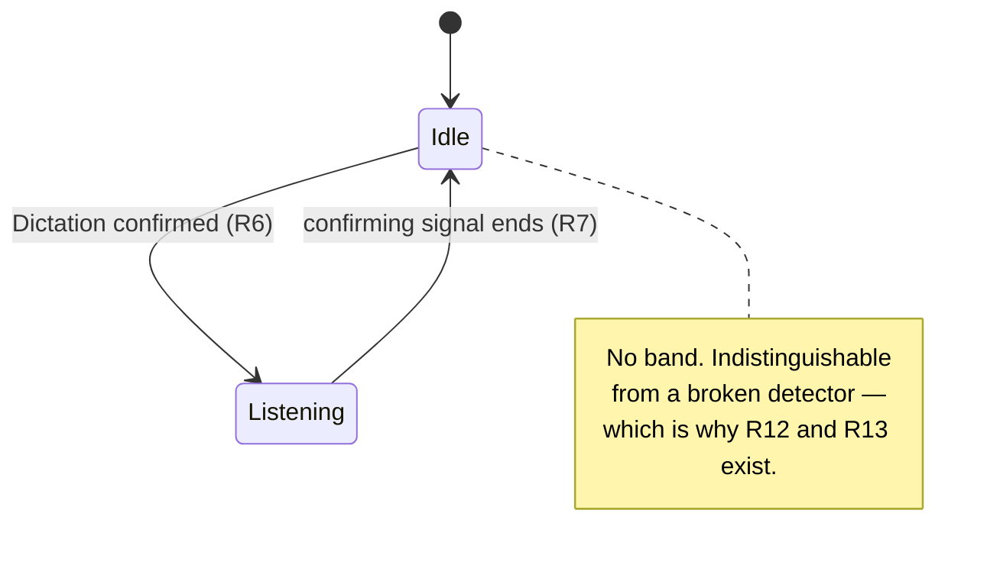

# Dictation Glow - Plan

## Goal Capsule

- **Objective:** A person dictating on this Mac knows at a glance, without looking away from what they are doing, whether native Dictation is currently listening — and notices the moment it stops on its own.
- **Means:** The overlay is fixed: axshot's perimeter band, in Dictation blue, one frame per display. The detection mechanism is not fixed and is chosen from what the diagnostic harness records.
- **Product authority:** The decisions below, settled in the brainstorm dialogue. `HANDOFF.md` is the originating brief.
- **Open blockers:** None for planning. The confirming signal is deliberately unidentified — the harness (R19–R21) is what identifies it, and the production detector cannot be specified until it has run.

---

## Product Contract

### Summary

A menu bar utility that draws a blue band around the perimeter of every display for exactly as long as native macOS Dictation is listening, and removes it the moment Dictation stops — including the silence timeout that currently passes unnoticed. The border is drawn only when Dictation is positively confirmed, so the app carries a self-test that makes its own silence falsifiable.

### Problem Frame

Native Dictation stops on its own after roughly thirty seconds without continuous speech, and nothing announces the cut. The timeout is widely documented and macOS exposes no setting to disable or extend it, so it is a fixed constraint to design around rather than a defect to work around. The person keeps speaking into a microphone that is no longer listening. They discover it when they next look at the screen, by which point a sentence or a paragraph is gone and has to be said again.

The cost is not the lost words so much as the loss of trust in the channel. Dictation stops being something you can use while looking elsewhere, which is most of what it is for. The existing indicator — a small floating element near the insertion point — is exactly where the eyes are not.

The failure is specifically the stop edge. The start is announced by the person's own deliberate act of triggering it; the stop happens by itself, silently, and at an unpredictable moment.

### Key Decisions

- **The border is binary: full strength while listening, plain fade at the edges.** (session-settled: user-directed — chosen over a decay cue that tracks the silence timer, and over a loud exit flash: the border's disappearance is itself the signal, and a decay cue would require a live speech-activity signal that this design removes from scope.) Governs R4, R5.
- **Attribution fails closed.** (session-settled: user-directed — chosen over fail-open and over treating any live microphone as the trigger: no stray border during calls, accepted with the silent-failure cost that R12 and R13 exist to answer.) Governs R6, R10, R12, R13.
- **The app is a menu bar application.** (session-settled: user-directed — chosen over a headless launch agent and over a status item that appears only when unhealthy: the self-test and permission state need somewhere to live, and macOS needs a visible app to hang the TCC grants on.) Governs R12, R13, R14.
- **The overlay and the permission provisioning are adopted from axshot rather than rebuilt.** (session-settled: user-directed — the window contract and TCC-stable signing are solved there and the failure modes are already documented.) Governs R1, R2, R15, R16.
- **The band's blue is a fixed `#0A84FF`, chosen from rendered candidates rather than sampled from Apple's indicator.** (session-settled: user-directed — chosen over sampling the live Dictation indicator and over three other candidate blues, judged as the actual band on a dark desktop.) The value is fixed rather than appearance-following because the band is drawn over other applications' windows and states its own colour, as axshot's does. Governs R3.
- **The self-test is a guided live test, not a passive precondition check.** (session-settled: user-directed — chosen over a passive precondition check and over running both: a precondition check can report healthy while detection is broken, which is the exact failure the test exists to catch.) Governs R12.
- **A live microphone the app cannot attribute to Dictation gets no indication of its own.** (session-settled: user-directed — chosen over a quiet marker for the unattributed state and over a heuristic marker limited to dictation-shaped sessions: the guided live test answers the health question on demand, and a permanent marker would be present mostly during calls, which is not what it is for.) Governs R6.
- **The band never appears before Dictation is confirmed; there is no optimistic path.** (session-settled: user-directed — chosen over raising the band on a recognized Dictation shortcut and withdrawing it if confirmation did not follow, and over leaving the choice to the harness: a shortcut that does not actually start Dictation would produce a blue flash, which is the false positive fail-closed exists to prevent.) This also removes keyboard monitoring from scope, and with it an Accessibility dependency the app may otherwise not need. Governs R6.
- **The app launches at login by default.** (session-settled: user-directed — chosen over shipping the login item opt-in and over manual start only: an app that is not running produces no band, which is indistinguishable from idle Dictation and from a broken detector, and unlike those two the guided live test cannot diagnose it.) Governs R18.
- **When reliability and latency conflict, reliability wins.** (session-settled: user-directed — chosen over treating the 300ms stop budget as a hard gate that disqualifies slower signals, and over deferring the tradeoff to the harness report: a band that is always correct but slightly late still beats today, where one that is fast but sometimes wrong reintroduces the doubt this exists to remove.) Governs R6, R11.
- **The diagnostic harness runs before the production detector is designed.** The candidate signals named in `HANDOFF.md` are candidates, not verified behavior; committing to one before observing a real session would be guessing. Governs R19, R20, R21.

### Requirements

**Overlay**

- R1. The overlay draws a band on the outer edge of every active display, one frame per display rather than one frame around the bounding box of all displays.
- R2. The overlay window does not activate, ignores mouse events, joins all Spaces, stays stationary, floats above full screen windows, and excludes itself from screen capture.
- R3. The band is `#0A84FF`, the dark-variant macOS system blue. The value is fixed and does not follow the system appearance or accent colour.
- R4. The band is at full strength whenever it is shown and carries no partial or intermediate states.
- R5. The band fades in when Dictation starts listening and fades out when it stops.

**Detection**

- R6. The overlay is shown only while native macOS Dictation is positively confirmed to be listening; a live microphone that cannot be attributed to Dictation never raises it.
- R7. The stop is detected whatever its cause — the user ending Dictation, the silence timeout, or the dictating application losing focus.
- R8. Stop detection does not depend on the microphone stream closing.
- R9. Detection is independent of how Dictation was started, covering the Globe double-tap, the Fn key, a custom shortcut, and the Edit menu.
- R10. Voice Control, Siri, and third-party dictation tools do not raise the overlay.
- R11. Where two candidate signals differ, the one with fewer false results is chosen over the faster one; the stop budget in Success Criteria is a target, not a disqualifier.

**Health and self-report**

- R12. An on-demand self-test prompts the person to start Dictation and then reports whether both the start and the stop were observed and how quickly, naming the missing permission or signal when detection fails. It does not report health from preconditions alone.
- R13. The app records when it last successfully confirmed a Dictation session and shows that time.
- R14. The app shows the live grant state of each permission it requires and offers to request each one.

**Build and provisioning**

- R15. Builds are signed with a stable self-signed certificate so TCC grants survive a rebuild; a build that falls back to ad-hoc signing says so rather than producing a binary whose grants will silently lapse.
- R16. The app re-spawns itself with responsibility disclaimed, so TCC attributes grants to the app rather than to whatever launched it.
- R17. The app is installed to `/Applications` and is never run from a temporary directory.

**Availability**

- R18. The app registers itself as a login item on first run so that a restart re-arms it without intervention, and the registration can be turned off.

**Diagnostic harness**

- R19. Before the production detector is built, a harness logs every candidate signal across real Dictation sessions, timestamped against observed ground truth.
- R20. The harness is exercised against a session where another application holds the microphone concurrently, and against each start path named in R9.
- R21. The harness output names which signals carry both the start and the stop edge, and states the failure modes of each.

### Key Flows

- F1. A dictation session
  - **Trigger:** The person starts Dictation by any of the paths in R9.
  - **Steps:** The confirming signal arrives and the band fades in. It stays at full strength for the session. The confirming signal going away — by any cause in R7 — fades it out.
  - **Outcome:** The band is up exactly while Dictation is confirmed listening, and never before.
  - **Covered by:** R4, R5, R6, R7

### Acceptance Examples

- AE1. Silence timeout
  - **Covers R5, R7.** Given Dictation is listening and the band is up, When the person stops speaking and Dictation times out, Then the band fades out within the stop budget.
- AE2. Concurrent microphone use
  - **Covers R8.** Given a video call holds the microphone and Dictation is also listening, When Dictation times out while the call continues, Then the band fades out — the still-open microphone stream does not hold it up.
- AE3. Microphone without Dictation
  - **Covers R6, R10.** Given Dictation is not running, When a call, a recording, or a third-party dictation tool opens the microphone, Then no band appears.
- AE4. A detector that has stopped working
  - **Covers R12.** Given the confirming signal no longer resolves, When the person runs the self-test and starts Dictation as it prompts, Then the test reports that the start was never observed and names the missing permission or signal, rather than reporting success because its preconditions still hold.
- AE5. Rebuild during harness work
  - **Covers R15, R16.** Given Accessibility has been granted, When the app is rebuilt and relaunched, Then the grant still holds and nothing has to be re-authorized.
- AE6. Displays of different heights
  - **Covers R1.** Given two displays of different heights, When the band is shown, Then each display carries its own complete band and no band segment runs through the dead space beside the shorter one.

### Success Criteria

- The stop is visible within roughly 300ms of Dictation ceasing to listen — about half a spoken word, so the person stops mid-word rather than mid-sentence. This is a target; per R11 a more reliable but slower signal is preferred to a faster one that is sometimes wrong.
- Over a week of ordinary use, the band never appears while Dictation is not running.
- No rebuild during harness work requires re-granting Accessibility.
- The self-test distinguishes a healthy detector with Dictation idle from a detector that has stopped working.

### Scope Boundaries

- Any cue that tracks the silence timer as it runs down — considered and cut with the binary decision above.
- Any indication for a live microphone the app cannot attribute to Dictation — considered and cut; the guided live test is the health mechanism.
- Raising the band optimistically on a keypress ahead of confirmation, and the keyboard monitoring it would require.
- Voice Control, Siri, and third-party dictation tools.
- Anything that changes Dictation's own behavior: no transcription, no text insertion, no keeping the session alive past its timeout.
- Audio and haptic feedback.
- Per-application suppression or configuration.
- iOS and iPadOS.

### Dependencies and Assumptions

- macOS 26.6.2 is the development target. Signals verified there may not hold on earlier or later versions, which is part of what R21's failure modes must record.
- axshot is available as a sibling checkout to copy the band and the signing scripts from. It is a source, not a runtime dependency.
- The `Axshot Local Signing` identity is shared between the two applications. One keychain approval covers both, and TCC records stay independent because they key on bundle identifier.
- An application under a temporary directory cannot be granted Accessibility — LaunchServices registers no bundle there and `tccutil` cannot resolve the identifier — which is what R17 exists for. Requesting the grant from such a location also marks the client as prompted, so later requests return false with no dialog until the record is reset.
- The 300ms stop budget is derived from the purpose rather than measured, and is deliberately not a gate (R11).
- No public API attributes a live microphone to a specific process. The one existing attempt found in the field, MicState, rescans running processes once a second against a hardcoded list of known meeting applications. The harness should not expect to find a clean attribution signal, and R6 may have to rest on a Dictation-specific signal rather than on microphone ownership.

### Outstanding Questions

**Deferred to Planning**

- Which signal confirms Dictation. The harness answers this; the production detector cannot be specified before it has run.
- Whether Screen Recording is required. It is needed only if the confirming signal reads window titles from the window server; window owner, layer, and bounds are readable without it.
- Fade durations.

### Sources and Research

- `HANDOFF.md` — the originating brief and the candidate-signal list.
- axshot, `axshot.swift:5702` (`DriveFrameView`) — the band: a 4pt solid edge plus 16 concentric 1pt rings with quadratic alpha falloff, and the reasoning for one frame per display.
- axshot, `axshot.swift:5577` (`DriveFrame`) — the window contract behind R2, including `sharingType = .none` and the screen-parameter observer.
- axshot, `axshot.swift:4777` (`Permissions`) — the preflight/request split, the System Settings deep link, the `tccutil` reset for a stale record, and the settings rows that re-poll so a grant made elsewhere appears without a relaunch.
- axshot, `axshot.swift:719` (`respawnDisclaimed`) — the basis for R16.
- axshot, `create-signing-cert.sh` and `build.sh` — the basis for R15, including the keychain-dialog timeout and the ad-hoc fallback warning.
- Verified on this machine, 2026-09-20, macOS 26.6.2: `DictationIM.app` and `corespeechd` run persistently, so process presence alone is not a signal. With Dictation idle, no Dictation-owned window is on screen and the default input device reports `kAudioDevicePropertyDeviceIsRunningSomewhere = 0`. That property is public, takes a listener rather than a poll, and needs no TCC grant — but it cannot be the authority on the stop edge, which is what R8 records.
